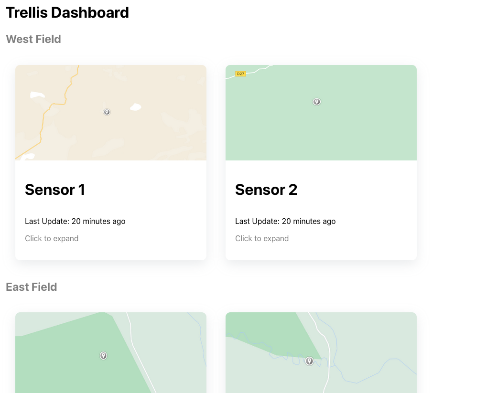
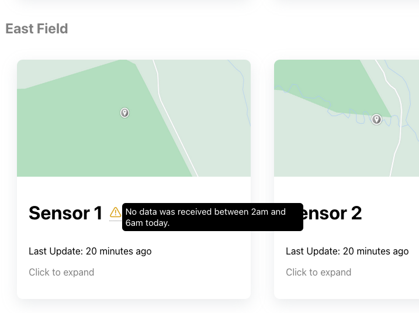
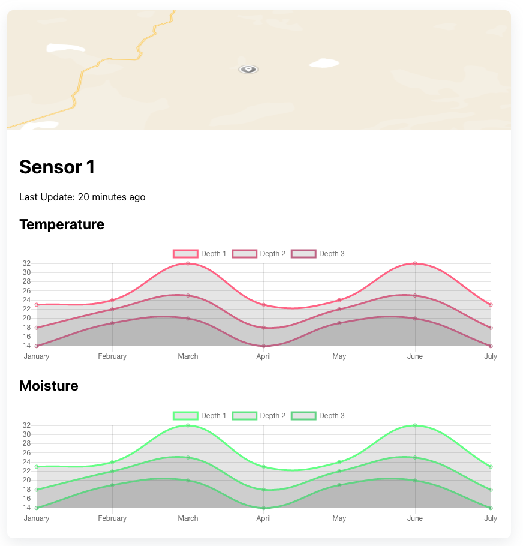

# UI Project Submission for Trellis Internship

All the code I wrote for this mockup is in `src/App.{tsx,css}`.

This UI assumes that each field and gateway is 1-1 for grouping them together.
None of that data is real, the mapped locations are screenshots from 
Google Maps. There is an object called `sampleGatewayDatas` that contains
all the data the UI displays.

## Screenshots

Overview of the dashboard

Support for warnings/errors

Expanded view

